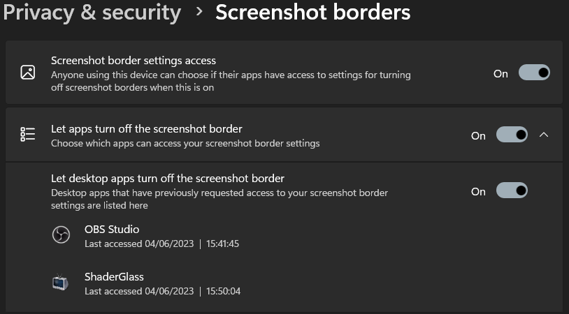
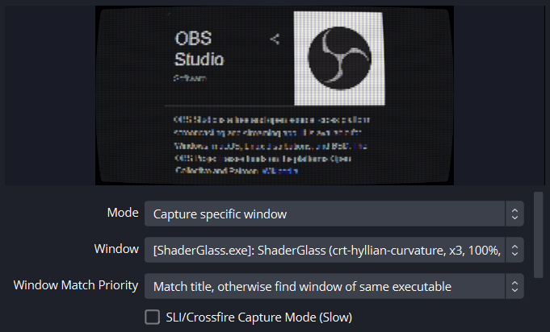

# ShaderGlass FAQ

---

### > I'm seeing black only

Make sure you're using __Windows 10, version 2004__ (build 19041) or __Windows 11__.

---

### > Can I use it with Reshade?

While there is no special support for it, you can inject Reshade into ShaderGlass just like into any other DirectX 11 app and stack Reshade shaders on top.

---

### > I see yellow border around captured screen/window

It's possible to disable yellow border but only on Windows 11. If you are using Windows 11 and still seeing the border,
open Windows Settings app and search for "screenshot borders". Make sure all the options and ShaderGlass are allowed to
remove the border per below:

---

### > I can't capture using OBS

OBS can capture ShaderGlass but only as a Game Capture source (not Window Capture nor Desktop Capture). Use "Capture specific window" within
Game Capture to select ShaderGlass window only.

---

## > Text/letters are all blurry or pixelated

For maximum sharpness set Input -> Pixel Size -> x1 but note that a lot of shaders expect pixelated input so set this option accordingly to each scenario.

---

## > Can I save a profile?

Yes, you can save shader profiles as files, access from Recent Profiles menu and even load them on startup via a command line parameter. See [README](README.md) for details.

---

## > I don't see my favourite RetroArch shader

ShaderGlass includes majority of RetroArch repository at time of release, but some shaders had to be excluded because of features SG doesn't yet support (for example HDR).
Differences vs RA repository are tracked in [this PR](https://github.com/mausimus/slang-shaders/pull/1).

---

## > ShaderGlass can't capture some windows

Unfortunately some old-style rendering windows are not supported by modern Windows Capture API. Please use Desktop mode to capture those.

---

## > Can I...

Please read through [README](README.md) to find functionality you are looking for.
