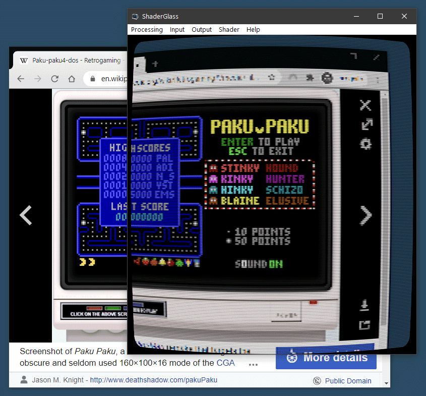
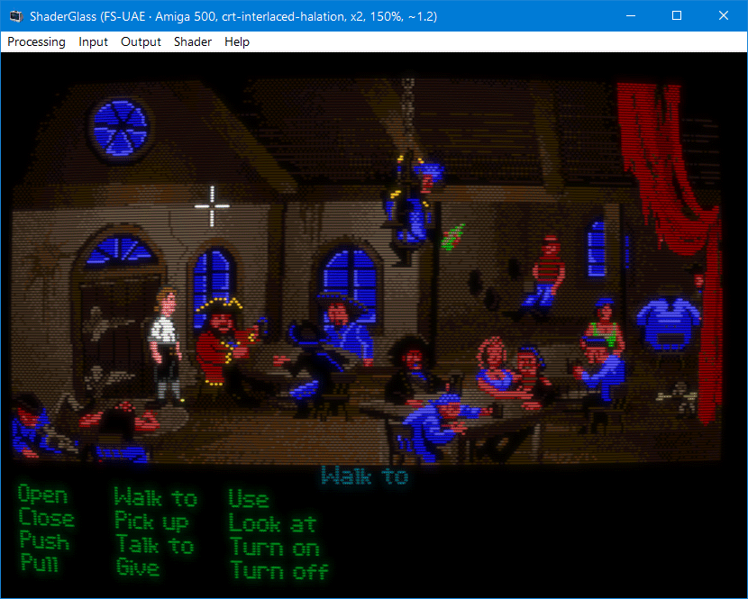
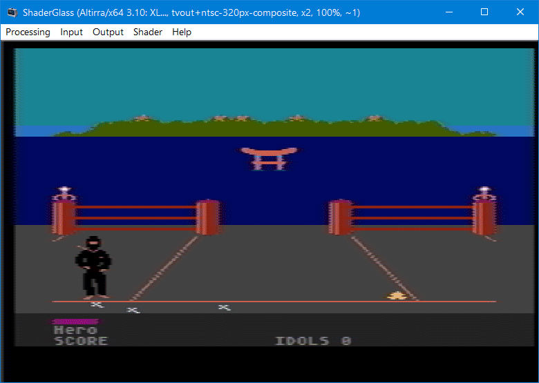
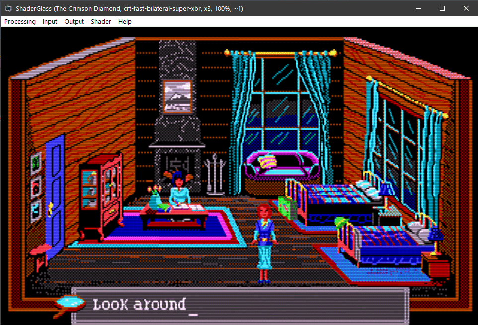
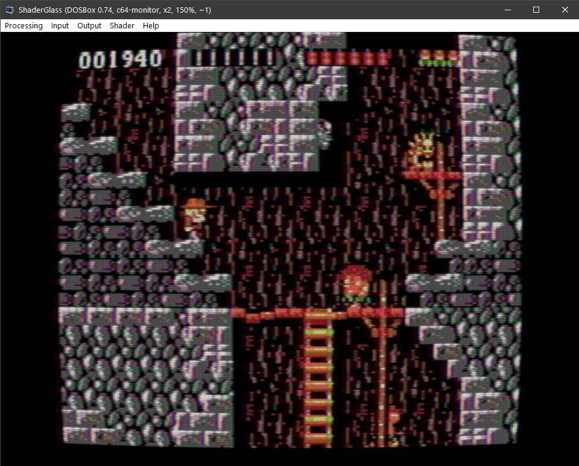
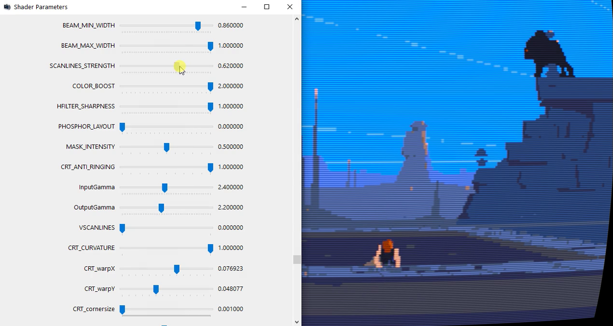

  

## ShaderGlass

Overlay for running GPU shaders on top of Windows desktop.

### Features

* applies shader effects on top of any window on the desktop
* includes [RetroArch](https://github.com/libretro/RetroArch) shader library covering:
  * CRT monitor simulation
  * image upscaling
  * TV / VHS simulation
  * softening, denoising, blur, sharpen and many more
* works with most emulators and retro platforms including:
  * [DOSBox](https://www.dosbox.com/), [FS-UAE](https://github.com/FrodeSolheim/fs-uae), [Altirra](http://www.virtualdub.org/altirra.html),
  [ScummVM](https://github.com/scummvm/scummvm), [AGS](https://github.com/adventuregamestudio/ags), [VICE](https://sf.net/projects/vice-emu), etc.
* excellent companion for pixel art drawing showing shaded and/or aspect-ratio corrected preview
* you can even use it on top of YouTube, Twitch or modern games
* saving and loading profiles
* multiple operating modes, including borderless fullscreen

<br/>

### Download

Latest release (v0.6, 31st Oct 2021):
* adds ability to fine-tune Parameters for each shader
* refresh of RetroArch shader library (200+ new shader profiles)

https://github.com/mausimus/ShaderGlass/releases/download/v0.6/ShaderGlass-0.6-win-x64.zip

<br/>

Follow [ShaderGlass on itch.io](https://mausimus.itch.io/shaderglass) for latest updates.

<br/>

### Requirements

* __Windows 10, version 2004__ (build 19041) or __Windows 11__
  * will work on version 1903 but in limited capacity (no Desktop Glass mode)
  * Windows 11 allows the __removal of yellow border__ around capture
* DirectX 11-capable GPU

If the app reports missing libraries please install [Visual C++ Redistributable 2019](https://aka.ms/vs/16/release/vc_redist.x64.exe)

<br/>

### Screenshots

##### Desktop Glass mode

In this mode a transparent floating window will apply a shader to anything behind it.
This mode is not OBS-friendly, use Window Glass or Clone modes to capture ShaderGlass.
Requires Windows 10 2004 - on 1903/1909 you will see only a black window if you switch to this mode.

Wikipedia in Chrome processed by crt-geom shader which applies scanlines and CRT curvature.



##### Window Clone mode

When capture is fixed to a specific window it's easier to tune scaling to match the input
and image can also be recaptured (screenshot/OBS etc.)

###### FS-UAE

Amiga version of [The Secret of Monkey Island (1990)](https://store.steampowered.com/app/32360/The_Secret_of_Monkey_Island_Special_Edition/)
running in FS-UAE with crt-interlaced-halation shader applied.



###### Altirra

[Ninja (1986)](https://www.mobygames.com/game/ninja_) for the Atari XL
running in Altirra with a TV-OUT simulation shader.



###### Adventure Game Studio

[The Crimson Diamond (2020)](https://store.steampowered.com/app/1242790/The_Crimson_Diamond_Chapter_1/),
a modern AGS game softened using crt-fast-bilateral-super-xbr shader.



###### DOSBox

[Police Quest (1987)](https://store.steampowered.com/app/494740/Police_Quest_Collection/)
with its massive half-EGA pixels, aspect-ratio corrected and post-processed using newpixie-crt shader.


[Rick Dangerous (1989)](https://www.mobygames.com/game/rick-dangerous)
with C64 monitor shader applied.



<br/>

### Options

Currently supported options are:

* _Input -> Desktop_ - captures the whole desktop or an individual monitor, defaults to Glass mode

* _Input -> Window_ - captures the selected window, defaults to Clone mode

* _Input -> Capture Cursor_ - whether to include mouse cursor in capture

* _Input -> Remove Yellow Border_ - disables yellow frame around captured area (forced security feature); currently only supported on Windows 11

* _Input -> Pixel Size_ - indicates the size of input pixels (pre-scaling), i.e. if you run a game in x3 scaling mode set this to x3 as well so that ShaderGlass can tell the original resolution

* _Output -> Mode_ - overrides default mode for the input type:

  * _Glass_ (default for Desktop) - ShaderGlass window appears transparent, you have to position it over the window or area you'd like to capture

  * _Clone_ (default for Window) - ShaderGlass copies the content of capture so you can position it anywhere; this mode is also faster and more compatible

* _Output -> Window_ - override mouse behavior:

  * _Solid_ (default for Clone) - ShaderGlass window area is solid (traps mouse events), with the only exception of passing focus to captured window when clicked

  * _Click-through_ (default for Glass) - ShaderGlass window area is transparent and clickable/scrollable-through to window(s) underneath

* _Output -> Scale_ - apply additional scaling to the output if you'd like it to be larger; using no pre-scaling and only output scaling should result in best performance

* _Output -> Aspect Ratio Correction_ - presets for common aspect ratio correction factors (DOS, etc.), applied horizontally to preserve scanline count

  * If you select _Custom_ you can enter your own correction ratio expressed as pixel height (1.0 being square pixel). For example,
  in MS-DOS era a picture of 320x200 resolution (16:10) was displayed on a 4:3 screen meaning each pixel was 1.2x tall on screen, 1.2 = (16/10) / (4/3)

* _Output -> Frame Skip_ - in order to improve performance divide frame rate by n (capture is done at VSync rate)

* _Output -> Fullscreen_ (Ctrl+Shift+G) - turn ShaderGlass into a topmost fullscreen borderless window, in Glass mode you will still see yellow outline around the screen but if you can use
Window Glass (surrounding black bars) or Window Clone (top-left aligned) with your source then you can avoid yellow edges; press Ctrl+Shift+G to revert

* _Shader_ - choose RetroArch shader to apply, or _none_ shader for testing

  * _Parameters_ - show and modify active shader's parameters

You can save and load profile files which will store all the options. It's also possible to pass profile file path on the command
line and ShaderGlass will load it on startup.

<br/>

### Command Line

```
ShaderGlass.exe [-p|--paused] [-f|--fullscreen] [profile.sgp]
```

You can pass profile filename as a command-line parameter to ShaderGlass.exe and it will be auto-loaded.

In addition -p will launch in paused mode, and -f will launch in fullscreen mode.

<br/>

#### Tuning

In order to achieve the best effect it's necessary to tune parameters to match your input:

* if you use scaling in your input, use nearest-neighbour (i.e. no smoothing) and set _Input -> Pixel Size_ to match

* moving/resizing the window slightly might also help find the best fit for downscaling pixels

* use Window Clone mode if you can, it's fastest and most compatible; if you need mouse click-through use Glass mode

__Always check that input is crisply pixelated using the "none" shader__ as there is often implicit
scaling happening (for example even when Chrome displays an image at 100%, Windows DPI scaling is still applied).
The none shader should display a pixelated image with no smoothing whatsoever,
try to match Input Pixel Size setting with your input's size to achieve that.

### Parameters

All shaders start using default Parameters as defined by their authors, but you can also tweak them using
_Shader -> Parameters_ menu option.



##### Emulators

Most emulators (DOSBox, FS-UAE, Altirra etc.) will capture mouse by default so you can use them in Window Clone mode.
ShaderGlass window will remain topmost so just position it over the
game window and Alt-Tab to the game to have mouse and focus captured.

##### ScummVM

ScummVM doesn't capture mouse cursor by default so for best results follow below steps:
1) Use Window Clone mode, set Input/Output/Shader options to your liking
2) Switch Output Window to Click-through
3) Click or Alt-Tab to ScummVM game window so that it has focus
4) Press Ctrl-M which will force ScummVM to capture mouse

This way you should have the mouse captured by ScummVM so that it remains within
the game window until you press Ctrl-M again. You can apply output scaling
and/or aspect ratio correction in ShaderGlass and enjoy the game.

<br/>

### Code

Built using Visual Studio 2019 using ISO C++ 20, Windows SDK 10.0.20348, Windows Capture API and DirectX 11.

ShaderGlass includes a limited implementation of RetroArch shader back-end.
[ShaderGen](ShaderGen) is a command-line tool for converting Slang shaders 
into .h files which can be merged into ShaderGlass. The conversion process requires:
1. [glslang](https://github.com/KhronosGroup/glslang) for converting Slang/GLSL shaders to SPIR-V
2. [SPIR-V cross-compiler](https://github.com/KhronosGroup/SPIRV-Cross) for converting those to HLSL (DX11 format)
3. [Direct3D Shader Compiler (fxc.exe)](https://developer.microsoft.com/en-us/windows/downloads/windows-10-sdk/) for pre-compiling into bytecode

<br/>

### Notices

* ShaderGlass application is provided under [GNU General Public License v3.0](LICENSE)

* Includes precompiled shaders from [libretro/RetroArch shader repository](https://github.com/libretro/slang-shaders).
Please refer to copyright notes within shader code for detailed copyright and license information about each shader.

* App icon courtesy of [Icons-Land](http://www.icons-land.com/)

* Big kudos to RetroArch team, emulator developers and the wide retro community!
