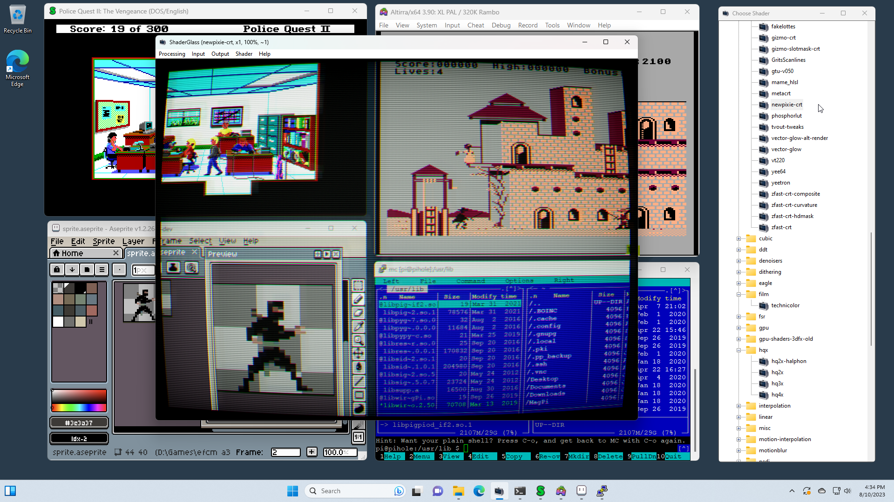
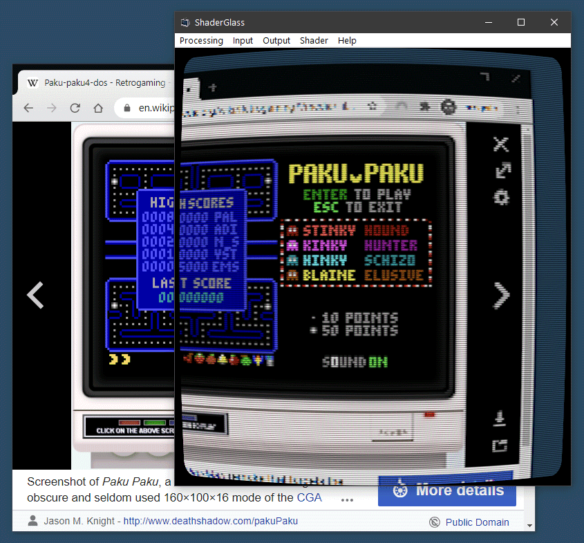
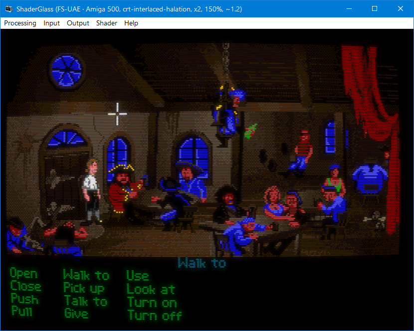
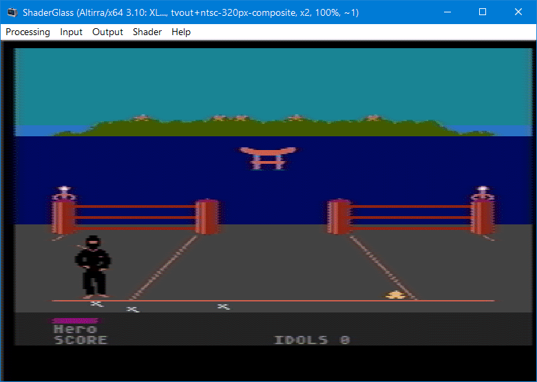
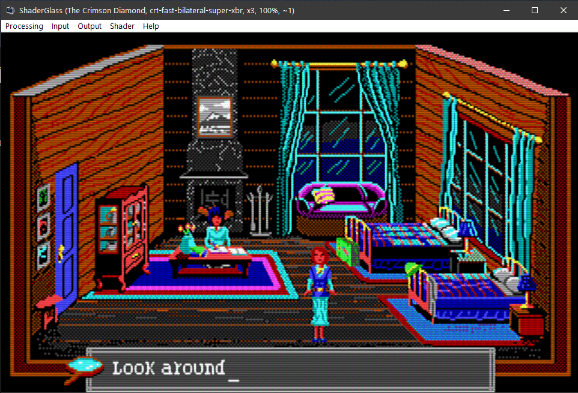
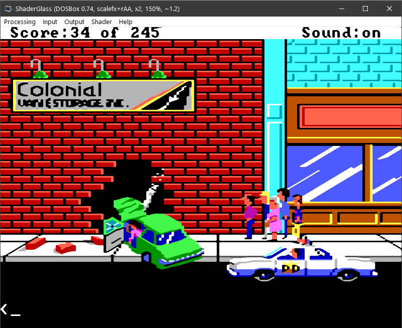
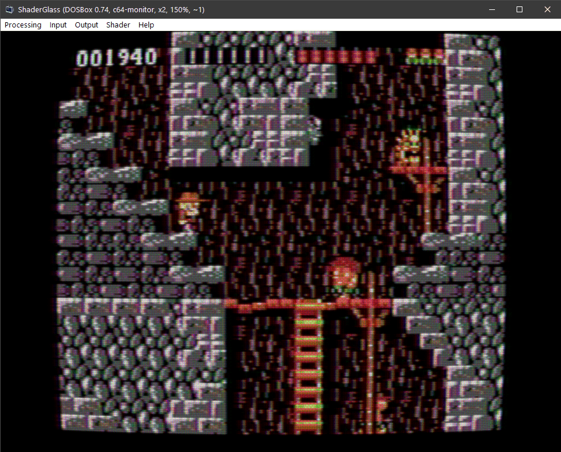

    

## ShaderGlass

Overlay for running GPU shaders on top of Windows desktop.

### Features

* applies shader effects on top of desktop, in a floating window or full-screen
* built-in [RetroArch](https://github.com/libretro/RetroArch) shader library (1200+ shaders!) covering:
  * CRT monitor simulation
  * image upscaling
  * TV, VHS and handheld simulation
  * softening, denoising, blur, sharpen and many more
* works with most emulators, retro platforms and pixel art editors including:
  * [DOSBox](https://www.dosbox.com/), [FS-UAE](https://github.com/FrodeSolheim/fs-uae), [Altirra](http://www.virtualdub.org/altirra.html),
  [ScummVM](https://github.com/scummvm/scummvm), [AGS](https://github.com/adventuregamestudio/ags), [VICE](https://sf.net/projects/vice-emu), [Aseprite](https://www.aseprite.org/) etc.
* excellent companion for pixel art showing shaded and/or aspect-ratio corrected preview
* you can even use it on top of YouTube, Twitch or modern games
* allows capture from a USB source (webcam or capture card)
* saving and loading profiles
* import of external .slangp/.slang shaders
* high customizability with various options, operating modes and shader parameters
* can be captured by OBS (using Game Capture source)

Check out [Online Manual](https://mausimus.github.io/ShaderGlass/MANUAL.html) for details.

 

### Download

Latest stable release (v1.2.x, 12 Dec 2025):
* device capture input (webcam/capture card)
* hide original mouse cursor when "Capture Cursor" is enabled
* ability to edit global hotkeys + more of them
* added Sonkun's presets
* (1.2.1) improved Device Capture performance & fixes
* (1.2.2) fix for browser video blanking out when inactive
* (1.2.3) minor fixes

https://github.com/mausimus/ShaderGlass/releases/download/v1.2.3/ShaderGlass-1.2.3.1-win-x64.zip

 

 

### Get it on Steam!

 

Black Frame Insertion (BFI) and Blur Busters' CRT Beam Simulator have been spun off
into a new app [ShaderBeam](https://github.com/mausimus/ShaderBeam).

[Betas and older versions available here](https://github.com/mausimus/ShaderGlass/releases)

 

### Requirements

* __Windows 10, version 2004__ (build 19041) or __Windows 11__
  * will work on version 1903 but in limited capacity (no Desktop Glass mode)
  * Windows 11 allows the __removal of yellow border__ (see [FAQ](FAQ.md#windows-10) for tips on avoiding it on Windows 10)
* DirectX 11-capable GPU

 

### Demo

Click to view on YouTube

### Screenshots

ShaderGlass running over multiple applications on Windows 11 desktop.

#### Desktop Glass mode

In this mode a transparent floating window will apply a shader to anything behind it.
Requires Windows 10 2004 - on 1903/1909 you will see only a black window if you switch to this mode.

Wikipedia in Chrome processed by crt-geom shader which applies scanlines and CRT curvature.

#### Window Clone mode

When capture is fixed to a specific window it's easier to tune scaling to match the input
and image can also be recaptured (screenshot/OBS etc.)

##### FS-UAE

Amiga version of [The Secret of Monkey Island (1990)](https://store.steampowered.com/app/32360/The_Secret_of_Monkey_Island_Special_Edition/)
running in FS-UAE with crt-interlaced-halation shader applied.

##### Altirra

[Ninja (1986)](https://www.mobygames.com/game/ninja_) for the Atari XL
running in Altirra with a TV-OUT simulation shader.

##### Adventure Game Studio

[The Crimson Diamond (2024)](https://store.steampowered.com/app/1098770/The_Crimson_Diamond/),
a modern AGS game using HSM MegaBezel STD shader.

##### DOSBox

[Police Quest (1987)](https://store.steampowered.com/app/494740/Police_Quest_Collection/)
with its massive half-EGA pixels, aspect-ratio corrected and post-processed using newpixie-crt shader.

[Rick Dangerous (1989)](https://www.mobygames.com/game/rick-dangerous)
with C64 monitor shader applied.

 

### Instructions & Manual

See [Online Manual](https://mausimus.github.io/ShaderGlass/MANUAL.html) for option explanations and Frequently Asked Questions.

 

### Code

Built using Visual Studio 2026 (Platform Toolset v145) using ISO C++ 20, Windows SDK 10.0.26100, Windows Capture API and DirectX 11.

ShaderGlass includes a limited implementation of RetroArch shader back-end using DirectX 11.
[ShaderGen](ShaderGen) is a command-line tool for converting Slang shaders 
into .h files which can be precompiled in ShaderGlass. The conversion process relies on:
1. [glslang](https://github.com/KhronosGroup/glslang) for converting Slang/GLSL shaders to SPIR-V
2. [SPIR-V cross-compiler](https://github.com/KhronosGroup/SPIRV-Cross) for converting those to HLSL (DX11 format)
3. [Direct3D Shader Compiler (fxc.exe)](https://developer.microsoft.com/en-us/windows/downloads/windows-10-sdk/) for pre-compiling into bytecode

 

### Notices

* ShaderGlass application is provided under [GNU General Public License v3.0](LICENSE)

* Includes precompiled shaders from [libretro/RetroArch shader repository](https://github.com/libretro/slang-shaders).
Please refer to copyright notes within shader code for detailed copyright and license information about each shader.

* App icon courtesy of Icons-Land

* Big kudos to RetroArch team, emulator developers and the wide retro community!

* Thanks to @lonestarr and @EndlesslyFlowering for PRs and everyone for feedback and testing :thumbsup:
